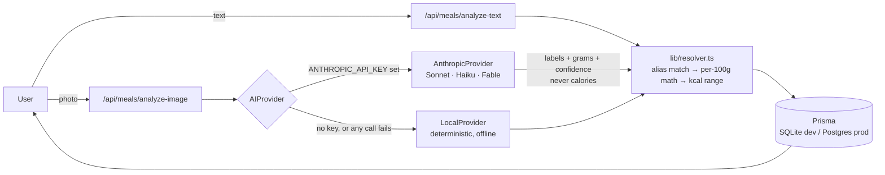

# Calazm — AI nutrition companion

[](https://github.com/abid8195/calazm/actions/workflows/ci.yml)

A calorie and nutrition tracker that logs meals from a photo or a sentence, then uses what you have left today — plus what it has learned about how you eat — to suggest what to eat next. Next.js 15 (App Router), TypeScript, Prisma, Tailwind, Claude via a provider abstraction.

**Status:** working prototype, single developer. Runs locally end-to-end without any API keys. Not yet deployed publicly; billing is not implemented (see [What's real and what isn't](#whats-real-and-what-isnt)).

## How it works

The design decision the whole app hangs on: **the AI model describes food; it never produces a number.** Every calorie and macro value comes from a nutrition database via plain arithmetic.

When you type "two eggs and toast with butter", a deterministic parser (`lib/resolver.ts`) splits the sentence, pulls out quantities and units ("two", "half", "200g", "a bowl of"), and matches each phrase against alias lists on the seeded food table. Each match gets a gram weight — either the explicit one, or the food's default serving scaled by the quantity — and the macros are `per100g × grams / 100`. No model is involved at all on this path, so it's free and instant.

A photo goes to a vision model, but the prompt asks for only three things per food: a generic label, an estimated portion in grams, and a confidence score. It explicitly says "do not estimate calories." The labels come back and go through the same alias matching and the same arithmetic as text. If the model had hallucinated "450 kcal" for something, it would have been ignored anyway — it has no channel to get a number into the result.

This buys three things. Nutrition values are reproducible and traceable to a database row. The expensive model call happens only for photos, and only once per image (results are cached by content hash). And "confidence" means something concrete: it's the parser's or the model's confidence in *what and how much*, which the app turns into a calorie range rather than a false-precision single number. Foods flagged as hidden-fat risks (curries, fried food, dressings) widen that range and trigger a one-tap clarifying question.

### Three models, chosen per task

All calls go through one `AIProvider` interface (`lib/ai/provider.ts`) with two implementations:

| Task | Model | Why this one |
|---|---|---|
| Photo → food labels + portion guesses | `claude-sonnet-5` (vision) | Needs to actually see the image; called once per unique photo |
| Text phrases the deterministic parser couldn't match | `claude-haiku-4-5-20251001` | Only runs on the leftovers, so a small fast model is enough — "normalize *this phrase* to a generic food name and grams" |
| Weekly review narrative | `claude-fable-5` | Once per user per week; the one place a stronger model's judgment is worth paying for |

The **`AnthropicProvider`** is used when `ANTHROPIC_API_KEY` is set. The **`LocalProvider`** is the fallback when it isn't, and also what every Anthropic call falls back to on a network error, a non-2xx response, or unparseable output. It runs the deterministic parser for text, returns `null` for the narrative (the app then uses a template), and for photos it can only guess from words in the filename — so **without a key, photo recognition effectively doesn't work**, and the UI says so rather than failing silently.

I haven't benchmarked model accuracy; the three-way split is a cost and latency decision, not a measured one. The fallback behavior *is* tested — `tests/provider.test.ts` mocks `fetch` to reject, return a 5xx, and return malformed JSON, and asserts the result equals what `LocalProvider` would have produced.

### Request flow



### What the personalization actually is

"Calazm Memory" is structured rows, not stored chat. Each logged meal upserts `UserMemory` rows (frequent foods, usual meal per slot). Each portion correction on the review screen is stored as a `FoodCorrection` and rolled into a per-food typical portion; once a food has been corrected twice, the parser uses your gram value instead of the default serving. Recommendations (`lib/recommend.ts`) score candidates against remaining calories and protein and boost anything from your own history. All of this is plain TypeScript with no model in the loop.

## Screenshots

*Placeholders — capture at phone width (375px) in light mode, drop the files into `docs/screenshots/`, and the links below will resolve.*

| | |
|---|---|
|  |  |
| **01-today.png** — `/today` after logging one meal: calorie ring, macro bars, "Next best action" card | **02-review.png** — `/log` after typing "chicken curry and a bowl of rice": confidence chip, kcal range, the "cooked with much oil?" clarifier |
|  |  |
| **03-discover.png** — `/discover` with the "High protein" filter on, showing ranked suggestions with their "why" | **04-insights.png** — `/insights` after correcting egg portions twice, so the "What Calazm has learned" panel shows a learned portion |

## What's real and what isn't

Being precise about this matters more to me than the feature list.

**Working and tested**
- Text and photo logging pipeline, confidence/range calculation, clarifying questions, one-tap saved meals
- Target calculation (Mifflin-St Jeor with a capped deficit/surplus and a calorie floor), dashboard, day-plan split, Balance score
- Portion learning from corrections, usual-meal memory, history-boosted recommendations
- Weight trend averages; a maintenance-calorie *estimate* appears after ~14 logged days and 5 weigh-ins — it is displayed, it does not change your targets
- Weekly review: a template narrative offline, model-written with a key
- Free-tier metering (10 photo scans/month), vision-result caching by image hash, failed scans don't consume quota
- Privacy page, JSON data export, in-app account deletion
- Unit tests (Vitest, 46 tests) for the resolver, provider fallback, and target math; HTTP-level integration scripts against a running dev server (`scripts/e2e.mjs`, 32 checks; `scripts/store-prep-test.mjs`, 11 checks)

**Stubbed — looks like a feature, isn't one yet**
- **Billing.** There is no payment processing. `POST /api/subscriptions` writes `plan: "plus"` straight to the database; the "Plus · $2.99/mo" button in Profile grants Plus for free. It exists so the gating logic (scan metering, ad removal) could be built and tested. Stripe (web) and RevenueCat (native IAP) are planned and not started. The `/admin` dashboard's "MRR" is `Plus rows × $2.99` — a projection over stub rows, not revenue.
- **Ads.** `components/AdSlot.tsx` renders an AdSense unit for free-tier users if `NEXT_PUBLIC_ADSENSE_ID` is set, and a labeled house ad for Plus otherwise. No AdSense account exists; the real-ad path has not been exercised.
- **Native apps.** `capacitor.config.ts` and `docs/04-mobile-release.md` are the plan. No native project has been generated or submitted to either store. The PWA manifest and service worker are in place but haven't been verified on a physical device.

**Known limitations — deliberate for a prototype, not production-ready**
- **Photo storage is local disk** (`public/uploads`). Fine on a single host with a volume; wrong for serverless or multiple instances. Needs object storage.
- **Rate limiting is in-memory** (`lib/ratelimit.ts`). Correct for one process; resets on restart and doesn't coordinate across instances. Needs Redis or equivalent before scaling out.
- **SQLite in development.** The schema is Postgres-compatible, but I've only run it on SQLite.
- Food database is ~85 curated entries, not a licensed nutrition dataset. Anything not in it is reported as unmatched rather than guessed.

## Run it locally

```bash
npm install
cp .env.example .env      # defaults work as-is; add ANTHROPIC_API_KEY for photo recognition
npx prisma db push        # creates SQLite dev.db
npm run db:seed           # loads the curated food table
npm run dev               # http://localhost:3000
```

Sign up → onboarding → Log → type "two eggs and toast with butter and a banana" and follow it through Today, Discover and Insights.

```bash
npm test                  # Vitest unit tests (no server needed)
npm run typecheck && npm run lint
node scripts/e2e.mjs      # integration checks; dev server must be running
```

CI runs typecheck, lint, and the unit tests on every push and PR to `main`.

## Deploying

Nothing is deployed yet. The `Dockerfile` builds the app and runs `prisma db push` + seed on boot, which suits a single-instance host with a persistent volume (set `DATABASE_URL=file:/data/calazm.db`). For serverless hosting, switch the Prisma provider to PostgreSQL and replace the local-disk photo write first. Every environment variable is listed with a comment in [`.env.example`](.env.example).

Before any public launch: real billing, object storage for photos, shared rate limiting, a strong `SESSION_SECRET`.

## More

[Product strategy](docs/01-product-strategy.md) · [Information architecture & design](docs/02-experience.md) · [Architecture notes](docs/03-architecture.md) · [Mobile release playbook](docs/04-mobile-release.md) · [Case study draft](docs/05-case-study.md)
